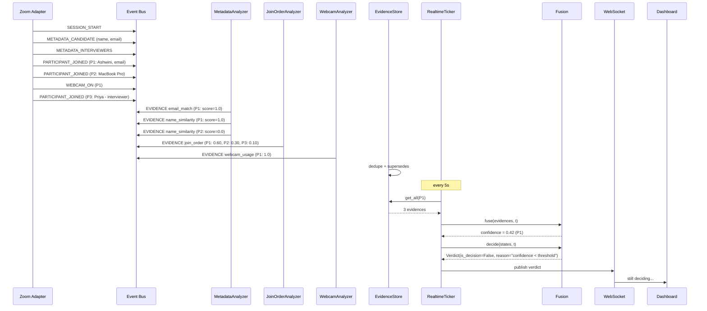
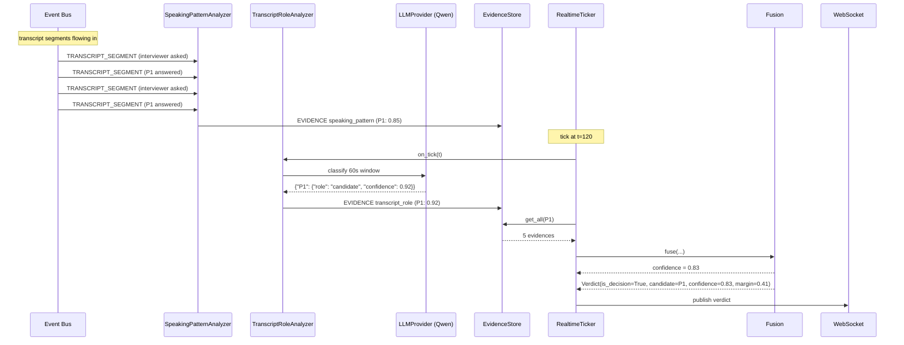
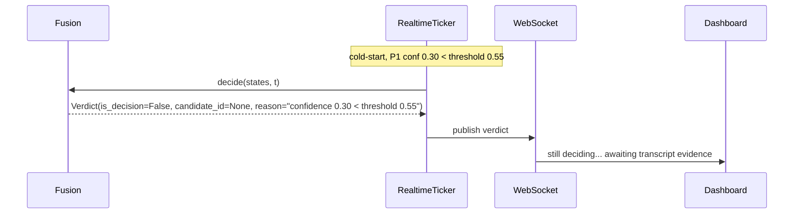
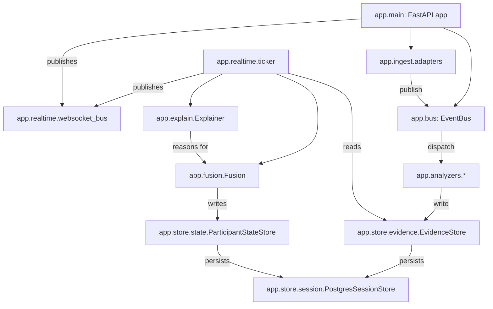

# ARCHITECTURE.md — System Architecture

> **Status:** v1.0
> **Cross-refs:** [APPROACH.md](./APPROACH.md) · [DATA_CONTRACT.md](./DATA_CONTRACT.md) · [SIGNALS.md](./SIGNALS.md) · [PLATFORM_INTEGRATION.md](./PLATFORM_INTEGRATION.md) · [ROADMAP.md](./ROADMAP.md)
> **Purpose:** Defines the system shape, components, data flows, deployment topology, scaling strategy, and failure modes. The rendered diagram is in [ARCHITECTURE.svg](./ARCHITECTURE.svg). This document is the source of truth for the architecture; the SVG is a derived deliverable for PDF Deliverable #4.

---

## 0. Architecture at a Glance

```
┌───────────────────────────────────────────────────────────────────────────┐
│                                INGEST LAYER                                │
│  ┌──────────────┐    ┌──────────────┐    ┌──────────────┐    ┌───────────┐ │
│  │ Zoom Adapter │    │ Meet Adapter │    │ Mock Adapter │    │ Teams     │ │
│  │  (OAuth API) │    │  (Recording) │    │  (JSON file) │    │ (future)  │ │
│  └──────┬───────┘    └──────┬───────┘    └──────┬───────┘    └─────┬─────┘ │
│         │                   │                   │                  │       │
└─────────┼───────────────────┼───────────────────┼──────────────────┼───────┘
          │                   │                   │                  │
          ▼                   ▼                   ▼                  ▼
┌───────────────────────────────────────────────────────────────────────────┐
│                              EVENT BUS                                     │
│        (asyncio in-process  +  Redis pub/sub for cross-process scale)      │
└─────────┬─────────────────────────────────────────────────────────────────┘
          │
   ┌──────┴───────┬─────────────┬─────────────┬─────────────┬─────────────┐
   ▼              ▼             ▼             ▼             ▼             ▼
┌────────┐  ┌──────────┐  ┌────────────┐  ┌────────┐  ┌──────────┐  ┌──────────┐
│Metadata│  │ Audio    │  │ Transcript │  │Vision  │  │Behavior  │  │  Screen  │
│Analyzer│  │ Analyzer │  │ Analyzer   │  │Analyzer│  │ Analyzer │  │ Analyzer │
└───┬────┘  └────┬─────┘  └─────┬──────┘  └───┬────┘  └────┬─────┘  └────┬─────┘
    │            │              │             │            │             │
    └────────────┴──────────────┴─────────────┴────────────┴─────────────┘
                                    │
                                    ▼
                       ┌────────────────────────┐
                       │  EVIDENCE STORE         │  (Redis, keyed by
                       │  session_id+participant │   feature+supersedes)
                       └────────────┬────────────┘
                                    │
                       ┌────────────┴────────────┐
                       │   REALTIME TICKER (5s)   │
                       └────────────┬────────────┘
                                    │
                                    ▼
                       ┌────────────────────────┐
                       │     FUSION ENGINE      │  v1-weighted / v2-bayesian
                       └────────────┬────────────┘
                                    │
                                    ▼
                       ┌────────────────────────┐
                       │  PARTICIPANT STATE      │  (Redis)
                       └────────────┬────────────┘
                                    │
                       ┌────────────┴────────────┐
                       │     EXPLAINER            │  emits Verdict + reasons
                       └────────────┬────────────┘
                                    │
                ┌───────────────────┴──────────────────┐
                ▼                                       ▼
     ┌────────────────────┐                  ┌────────────────────┐
     │  Web Socket Bus    │ ──────────────►  │  Postgres Audit    │
     │  (FastAPI native)  │                  │  (verdict timeline) │
     └─────────┬──────────┘                  └────────────────────┘
               │
               ▼
     ┌────────────────────┐
     │   React Dashboard  │  ─── confidence timeline + reason panel
     └────────────────────┘
```

The same diagram is rendered as a deliverable in [ARCHITECTURE.svg](./ARCHITECTURE.svg).

---

## 1. Components

### 1.1 Ingest Adapters (`app/ingest/`)

The system's only entry point for external data. All adapters implement the same `IngestAdapter` interface and emit `Event` records into the Event Bus.

| Adapter | Source platform | Authentication | Streams |
|---|---|---|---|
| `ZoomAdapter` | Zoom OAuth + Meeting Webhooks + Recording API | OAuth 2.0 (`meeting:read`, `recording:read`) | Per-participant audio (Zoom's separate-multitrack recording), speaker-attributed transcript via Zoom's `RecordingContent`. |
| `MeetAdapter` | Google Meet Recording API + Chrome extension as fallback | GCP service account + OAuth for Recording API | Per-participant audio track (multi-track recording), Google Speech-to-Text diarized transcript (or per-track Whisper). |
| `MockAdapter` | Replays `/data/recordings/*.json` | n/a | Deterministic replay of recorded meetings on a timer. Used in tests and the demo video. |
| `TeamsAdapter` (future) | Microsoft Graph — Teams APIs | OAuth client credentials | Same shape as Zoom. |

**Contract**: Each adapter calls `bus.publish(event: Event)` only. No analyzer talks to a platform adapter directly.

Spec details per adapter in [PLATFORM_INTEGRATION.md](./PLATFORM_INTEGRATION.md).

### 1.2 Event Bus (`app/bus.py`)

In-process `asyncio.Queue` per analyzer + Redis pub/sub for cross-process scale.

**Design**:
- Each analyzer subscribes to event types via `bus.subscribe(event_types, callback)`.
- The bus dispatches events in **per-source FIFO** order, deduplicating by `(source, envelope.sequence)`.
- For cross-process scale (rare for prototype, designed in for the `scalability 10%` rubric), the bus transparently uses Redis pub/sub — same interface from the caller's perspective.

**Implementation sketch** (full file in `app/bus.py`, roadmap Phase 1):

```python
class EventBus:
    def __init__(self, redis_url: str | None = None):
        self.redis = aioredis.from_url(redis_url) if redis_url else None
        self.subscribers = defaultdict(list)
        self.sequences_seen: set[tuple[str, int]] = set()

    async def publish(self, event: Event) -> None:
        key = (event.envelope.source, event.envelope.sequence)
        if key in self.sequences_seen:
            return  # dedupe
        self.sequences_seen.add(key)
        if self.redis is not None:
            await self.redis.publish(f"events:{event.type.value}", event.model_dump_json())
        for cb in self.subscribers[event.type]:
            await cb(event)

    def subscribe(self, event_types: list[EventType], callback: Callable[[Event], Awaitable]) -> None:
        for et in event_types:
            self.subscribers[et].append(callback)
```

### 1.3 Analyzers (`app/analyzers/`)

Each analyzer is a Python class subclassing `Analyzer` (see [DATA_CONTRACT.md](./DATA_CONTRACT.md) §8). The five families defined in [SIGNALS.md](./SIGNALS.md):

```
app/analyzers/
├── metadata.py          # owns: name_similarity, email_match, device_name
├── join_order.py        # owns: join_order
├── webcam.py            # owns: webcam_usage
├── speaking_pattern.py  # owns: speaking_pattern, speaking_ratio (disabled)
├── transcript_role.py   # owns: transcript_role
├── vision.py            # owns: face_consistency, screen_share_content
└── base.py              # Analyzer ABC
```

Each analyzer:
- Subscribes to specific `EventType`s.
- Owns exactly one or more `feature` keys (no two analyzers share a feature).
- Emits `Evidence` records into the Evidence Store.
- HAS NO KNOWLEDGE of any other analyzer.

### 1.4 Evidence Store (`app/store/evidence.py`)

Redis-backed. Keyed by `(session_id, participant_id, feature)`. Last-write-wins per feature (the `supersedes` mechanism removes the prior evidence when a new one arrives).

```python
class EvidenceStore:
    async def add(self, evidence: Evidence) -> None:
        # remove prior evidence that this new one supersedes
        if evidence.supersedes is not None:
            old_key = f"ev:{evidence.session_id}:{evidence.participant_id}:{evidence.supersedes}"
            await self.redis.delete(old_key)
        key = f"ev:{evidence.session_id}:{evidence.participant_id}:{evidence.feature}"
        await self.redis.set(key, evidence.model_dump_json(), ex=86400)
        await self.redis.sadd(f"ev_index:{evidence.session_id}:{evidence.participant_id}", key)

    async def get_all(self, session_id: str, participant_id: str) -> list[Evidence]:
        keys = await self.redis.smembers(f"ev_index:{session_id}:{participant_id}")
        return [Evidence.model_validate_json(await self.redis.get(k)) for k in keys]
```

TTL: 24 hours post-session for safety; durable copy persisted to Postgres every 60s.

### 1.5 Realtime Ticker (`app/realtime/ticker.py`)

A single async task that fires every 5 seconds across all live sessions:

```python
async def ticker(session_id: str, stop_event: asyncio.Event):
    while not stop_event.is_set():
        await asyncio.sleep(5)
        for participant_id in await get_present_participants(session_id):
            await run_analyzer_ticks(session_id, participant_id, current_ts())  # analyzer.on_tick()
            evidences = await evidence_store.get_all(session_id, participant_id)
            confidence = await fusion.fuse(evidences, current_ts())
            await participant_state_store.update(session_id, participant_id, confidence, evidences)
        verdict = await fusion.decide(session_id, current_ts())
        await websocket_bus.publish(verdict)
        await postgres_session_store.record_verdict(verdict)
```

### 1.6 Fusion Engine (`app/fusion/`)

Two interchangeable implementations both implementing the `Fusion` Protocol:

```python
class Fusion(Protocol):
    def fuse(self, evidences: list[Evidence], t: float) -> float: ...
    def decide(self, session_id: str, t: float) -> Verdict: ...
```

- **`v1-weighted`**: the formula in [DATA_CONTRACT.md](./DATA_CONTRACT.md) §4.3. Default in v1.0.
- **`v2-bayesian`** (future, after `tune.py` calibrates priors): treats each evidence as a likelihood update on a per-participant beta-distribution prior. Specified in [ACCURACY_METRICS.md](./ACCURACY_METRICS.md) §6. Switched on via `weights.json`.

### 1.7 Explainer (`app/explain/generator.py`)

```python
class Explainer:
    def render(self, top_state: ParticipantState, runner_state: ParticipantState | None) -> tuple[list[str], list[RejectedHypothesis]]:
        reasons = []
        sorted_evidence = sorted(top_state.raw_evidence, key=lambda e: e.weight * e.score, reverse=True)
        for e in sorted_evidence[:7]:
            contribution = e.weight * e.score
            if contribution > 0:
                reasons.append(f"{e.reason} (+{contribution:.3f})")

        rejected = []
        if runner_state:
            rejected.append(RejectedHypothesis(
                participant_id=runner_state.participant_id,
                display_name=runner_state.display_name,
                confidence=runner_state.confidence,
                top_negative_reasons=[
                    e.reason for e in sorted(runner_state.raw_evidence, key=lambda e: e.weight * e.score)[:3]
                ],
            ))
        return reasons, rejected
```

Truncated bullets to top 7 for dashboard legibility.

### 1.8 WebSocket Bus (`app/main.py`)

FastAPI WebSocket endpoint `/sessions/{session_id}/stream`:
- On connect: sends the most recent verdict.
- On each 5s tick: pushes the new verdict.
- On disconnect: cleanup.
- Multiple dashboard clients can subscribe to the same session.

### 1.9 Dashboard (`web/`)

React + Tailwind + Recharts. Three panels:

1. **Verdict panel**: `is_decision ? "Candidate: {name}" : "Still deciding…"`, confidence bar, `not_deciding_reason`.
2. **Per-participant timeline**: stacked area chart of confidence per participant over time (from /verdicts endpoint).
3. **Reason panel**: bullet list of `reasons[]` (+ contribution values); rejected hypotheses below.

Optional Phase 7 deliverable per [ROADMAP.md](./ROADMAP.md).

### 1.10 Persistence Tier

- **Redis**: live state (`ParticipantState`, `Evidence`, in-flight Verdicts).
- **PostgreSQL**: session history table, verdict table (autid timeline), accurately harness labels. See schema in [ACCURACY_METRICS.md](./ACCURACY_METRICS.md) §4.

---

## 2. Data Flow — Sequence Diagrams

### 2.1 Cold start (no transcript yet)



### 2.2 Mid-call Q&A phase



### 2.3 Candidate rename mid-call (edge case)

```mermaid
sequenceDiagram
    participant Bus as Event Bus
    participant Meta as MetadataAnalyzer
    participant Store as EvidenceStore
    participant Fusion
    participant Ticker as RealtimeTicker

    Note over Bus: before rename: P1 confidence=0.83
    Bus->>Meta: PARTICIPANT_RENAMED (P1: "Ashwini" → "MacBook")
    Meta->>Store: EVIDENCE name_similarity (P1: 0.0, supersedes="name_similarity")
    Note over Store: old name_similarity ev deleted

    Note over Ticker: tick at t=210
    Ticker->>Fusion: fuse (no name evidence; transcript/transcript-role/email still positive)
    Fusion-->>Ticker: confidence = 0.79  (small dip, still > threshold)
    Fusion-->>Ticker: Verdict(is_decision=True, candidate=P1, confidence=0.79)
```

### 2.4 Insufficient evidence (graceful uncertainty)



---

## 3. Deployment Topology

### 3.1 Single-process (default for prototype)

```
┌──────────────────────────────────────┐
│ FastAPI app: app.main:app             │
│  - all adapters                        │
│  - event bus (asyncio)                 │
│  - all analyzers (async)               │
│  - realtime ticker                     │
│  - fusion engine                       │
│  - websocket server                    │
│  - HTTP routes                         │
└──────────────────────────────────────┘
           │            │
        Redis         Postgres
        (state)       (audit)
         │                │
┌────────┴────────┐   ┌──┴───────────┐
│     Redis       │   │  Postgres    │
│  6379 (auth)    │   │  5432         │
└─────────────────┘   └──────────────┘
```

`docker-compose.yml` brings up the FastAPI app + Redis + Postgres in one command. See [ROADMAP.md](./ROADMAP.md) Phase 0 §2.

### 3.2 Cross-process (designed-in scalability)

For the `scalability 10%` rubric, the architecture supports horizontal split without code change:

```
┌────────────────────┐
│  Ingest Container  │ ──► Redis pub/sub ──► ┌────────────────────┐
│  (Zoom adapter)    │                         │ Analyzer Pool       │
└────────────────────┘                         │  (k independent     │
                                                │   containers, each  │
┌────────────────────┐                         │   subscribes)        │
│  Ticker Container  │ ─── reads evidences ───►│                     │
│  (1 per session)   │                         └────────────────────┘
└────────────────────┘
```

Cross-process communication uses Redis pub/sub ONLY — the analyzer interface remains unchanged. The system scales to N participant interrogations by adding analyzer containers.

This is documented but NOT implemented in v1.0. The single-process deployment is sufficient for the demo.

---

## 4. Failure Modes & Degradation

| Failure | System behavior | User-visible behavior |
|---|---|---|
| LLM provider unavailable | Transcript analyzer retries with exponential backoff (4s, 16s, 64s). Fallback to Ollama if configured. | Confidence grows slower; transcript_role evidence lags. Still reaches a verdict from other signals. |
| Redis unavailable | In-process asyncio.Queue falls back to in-memory event bus. Verdict emitted from in-memory evidence (may reset if process restarts). | Dashboard shows "Live state reset (Redis degraded)". |
| Postgres unavailable | Verdicts not persisted; in-memory history capped to last 1000 verdicts. | Dashboard history shows last hour only. |
| Platform adapter drops (Zoom token expired) | Re-auth via refresh token; events buffered in adapter for ≤30s. | Up to 30s of events delivered in a burst on reconnect. |
| Vision analyzer exceeds 50ms/event rule | AnalyzerTimeoutError → event dropped from this analyzer. | Vision signal silence; other signals carry. |
| Face-swap false alert | Anti-evidence emitted for the wrong participant. | Other signals (transcript, email) dominate; verdict still correct, but reason panel includes the false alert. |
| All signals below threshold | `is_decision=False` verdict persists indefinitely. | Dashboard shows "still deciding" — graceful per PDF p4. |
| Mock stream replays invalid JSON | MockAdapter logs error, stops emitting, session ends with `SESSION_END reason="error"`. | Tests fail loudly; no silent corruption. |

---

## 5. Performance & Latency Budget

For the target "real-time" behavior the system supports PDF bonus p4:

| Pipeline stage | Budget | Notes |
|---|---|---|
| Adapter ingestion → bus publish | ≤ 50 ms | Promise-resolved once event is on the bus. |
| Bus dispatch to all analyzers | ≤ 10 ms | Per analyzer callback (parallel). |
| Analyzer `on_event` returns | ≤ 50 ms each | Hard rule in [DATA_CONTRACT.md](./DATA_CONTRACT.md) §8.1. |
| Analyzer `on_tick` returns | ≤ 200 ms each | LLM analyzer is the long pole; runs in worker pool. |
| Evidence store add | ≤ 5 ms | Redis SET. |
| Ticker cycle | ≤ 500 ms (all participants) | 5 participants × 100 ms each. |
| Fusion `decide` | ≤ 5 ms | Pure compute over in-memory evidences. |
| WebSocket publish | ≤ 10 ms | Local network. |
| End-to-end (event → verdict on dashboard) | ≤ 700 ms typical, ≤ 1500 ms worst case | Meets "real-time" for human-paced interviews. |

Latency metrics are in [ACCURACY_METRICS.md](./ACCURACY_METRICS.md) §3.

---

## 6. Security & Privacy Considerations

- **No at-rest storage of audio/video bytes** — chunks and frames are processed in memory and discarded. Only audio metadata (duration) and screen-share labels are persisted.
- **Transcripts are persisted** to Postgres for `tune.py` calibration; access restricted to admin role.
- **Email hashes**: store `sha256(email)` in place of raw email for production sessions. Mock data uses raw emails for readability.
- **PII redaction** in reason-text generator: emails and phone numbers regex-redacted before persisting to Postgres audit table.
- **Zoom OAuth scopes**: minimum-required — `meeting:read`, `recording:read`. Never `meeting:write`.
- No face embeddings persisted — comparisons are in-memory per session.
- All HTTP routes are bearer-token authenticated (`X-API-Key`, rotating).

---

## 7. Module Dependency Graph



---

## 8. Stack Decision Trade-offs

### 8.1 FastAPI vs. Flask

| Choice axis | FastAPI | Flask |
|---|---|---|
| Async support | Native | via extensions (gunicorn worker class) |
| WebSocket | Built-in | Needs flask-sock |
| Pydantic integration | Native | Manual |
| Mock-data binding speed | Faster (Pydantic-driven serialization) | Manual |
| Maturity / docs | Excellent | Excellent |

FastAPI wins on async-native, which is the entire architecture.

### 8.2 Redis vs. pure in-memory

Redis is justified because:
- Cross-process scale (see §3.2).
- TTL'd evidence cleanup (24h) doesn't need application code.
- Production's actual Sherlock stack uses Redis anyway (we believe, based on public signals).

### 8.3 Per-track Whisper vs. diarization

Discussed in [SIGNALS.md](./SIGNALS.md) §6 and [PLATFORM_INTEGRATION.md](./PLATFORM_INTEGRATION.md). Per-track Whisper:
- Skips diarization (PDF p2 promises per-participant audio streams).
- Higher transcription accuracy (no cross-talk confusion).
- Higher compute (one Whisper run per participant).
- Acceptable for ≤8 participants and real-time on a single GPU.

### 8.4 InsightFace vs. dlib vs. face-recognition (ageis)

InsightFace wins for:
- Production-grade 512-dim ArcFace embeddings.
- ONNX inference portability.
- Doesn't include a face *database* matcher (which we'd be tempted to misuse for recognition).

### 8.5 v1 weighted fusion vs. v2 Bayesian

v1 weighted is the prototype default because:
- No priors to calibrate.
- Explainable, intuitive math.
- Stable.

Switch to v2 Bayesian once `tune.py` has ≥20 labeled sessions to estimate priors per signal.

---

## 9. Open Architectural Questions

These are explicitly open and documented for [ROADMAP.md](./ROADMAP.md) follow-up:

1. **Mock-stream JSON format vs. WebSocket fixture** — does the dashboard subscribe to mock directly, or via the same ingestion path?  In v1.0 we route mocks through the same ingest-layer bus, ensures parity with reality. [MOCK_DATA_FORMAT.md](./MOCK_DATA_FORMAT.md) details the JSON format.
2. **Per-session analyzer vs. global analyzer pool** — v1.0 uses per-session analyzer instances (one set per session). A global pool would save memory across many sessions but complicates state. Defer to v1.1.
3. **Hot-reload of `weights.json`** — v1.0 reads it on `SESSION_START` only. Hot-reload requires a pub/sub signal. Defer to v2.
4. **Multi-language transcript handling** — Whisper supports 99 languages; the LLM prompt is currently English-only. v1.0 errors out on non-English detected transcripts. v1.1 needs localized LLM prompts.

---

## 10. Service-Level Objectives (SLOs)

For production-grade feel:

| SLO | Target | Measurement |
|---|---|---|
| Verdict latency (event → dashboard) | p95 ≤ 1.5s | [ACCURACY_METRICS.md](./ACCURACY_METRICS.md) §3 |
| Decision accuracy (correct candidate at session end) | ≥ 90% on labeled data | [ACCURACY_METRICS.md](./ACCURACY_METRICS.md) §1 |
| Cold-start time (first decidable verdict) | p50 ≤ 5 min, p90 ≤ 10 min | [ACCURACY_METRICS.md](./ACCURACY_METRICS.md) §2 |
| Stability (verdict flips per session) | ≤ 2 per session after first decision | [ACCURACY_METRICS.md](./ACCURACY_METRICS.md) §2.4 |
| Graceful-decision rate (correct vs. forced) | ≥ 99% forced decisions correct | [ACCURACY_METRICS.md](./ACCURACY_METRICS.md) §5 |

---

## 11. Change Log

| Version | Date | Change |
|---|---|---|
| 1.0 | 2026-07-09 | First architecture draft. |

---

> **Next:** Read [PLATFORM_INTEGRATION.md](./PLATFORM_INTEGRATION.md) for real Zoom + Meet capture contracts; then [ROADMAP.md](./ROADMAP.md) for the build schedule.
