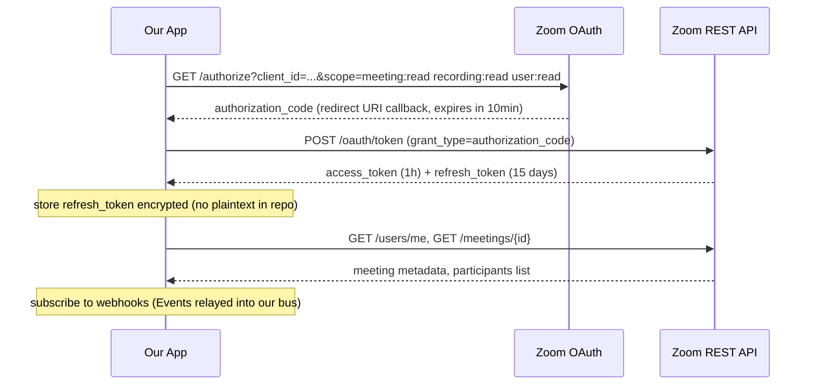
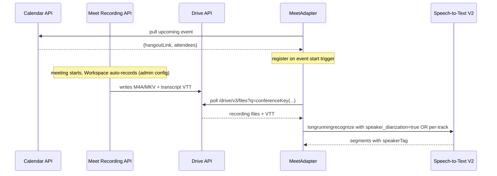

# PLATFORM_INTEGRATION.md — Zoom & Google Meet Adapter Contracts

> **Status:** v1.0
> **Cross-refs:** [ARCHITECTURE.md](./ARCHITECTURE.md) · [DATA_CONTRACT.md](./DATA_CONTRACT.md) · [SIGNALS.md](./SIGNALS.md) · [MOCK_DATA_FORMAT.md](./MOCK_DATA_FORMAT.md)
> **Purpose:** Spec for capturing live meeting data from Zoom and Google Meet. The Mock adapter parity contract is in [MOCK_DATA_FORMAT.md](./MOCK_DATA_FORMAT.md). Teams is explicitly out of scope for v1.0.

---

## 0. Why Per-Track Whisper, Not Diarization

PDF p2 promises:

> Separate audio stream for every participant

This is the most underutilized fact in the brief. It means we **do not need speaker diarization** — the platform already separates speakers for us. We just need to:

1. Capture each participant's audio track separately.
2. Run Whisper separately per track to get that participant's transcript.
3. Stitch the per-participant transcripts together by start/end timestamps to assemble the speaker-attributed transcript.

This is cleaner, more accurate, and avoids the diarization-failure mode of confusing similar voices. Each platform exposes a slightly different mechanism:

| Platform | Per-participant audio mechanism | When available |
|---|---|---|
| **Zoom** | Cloud Recording with `audio_metadata: { speaker_labels: true }` AND `recording_object: { multi_track_audio: true }`; OR raw real-time audio via `ExtractArchivedParticipantAudioAPI`. | Host enables cloud recording; admin approves OAuth app. |
| **Google Meet** | Google Workspace Recording produces per-track audio via Google Speech-to-Text `speaker_diarization` flag; OR Drive-stored multi-track MP4. Chrome-extension alternative when Recording API not available. | Workspace editions that support Recording (Enterprise + Education Plus). |

The Twist for both platforms: real-time Whisper per-track is the closest we get to the PDF's promise of "speaker-attributed transcript" without relying on platform diarization (often wrong).

---

## 1. Adapter Common Interface

Both Zoom and Meet adapters implement:

```python
# app/ingest/base.py
from abc import ABC, abstractmethod
from app.schema import Event, SessionEnvelope

class IngestAdapter(ABC):
    @abstractmethod
    async def start_session(self, session_envelope: SessionEnvelope) -> None: ...

    @abstractmethod
    async def stream_events(self) -> AsyncIterator[Event]: ...

    @abstractmethod
    async def end_session(self, reason: str = "normal") -> None: ...
```

Both adapters MUST emit `Event` records in monotonic-`sequence` order per source. Both MUST emit `SESSION_START` first and `SESSION_END` last.

---

## 2. Zoom Adapter

### 2.1 Authentication

OAuth 2.0 via Server-to-Server credentials or classic OAuth. Required scopes:

| Scope | Why we need it |
|---|---|
| `meeting:read` | Read meeting metadata: title, schedule, participants. |
| `meeting:write` | **NOT REQUESTED** — privacy-first principle. |
| `recording:read` | Pull recording files (multi-track audio, transcript). |
| `user:read` | Resolve participant userIds → emails (host-only). |

The OAuth flow:



Refresh token rotation handled by `ZoomAuth.refresh()`; tokens persisted to OS keychain (Windows Credential Manager / macOS Keychain via `keyring` library). `access_token` never logged.

### 2.2 Real-time events via Webhooks

Subscribe to Zoom Webhooks to drive real-time ingestion:

| Zoom Webhook event | Maps to our `EventType` | Note |
|---|---|---|
| `meeting.participant_joined` | `PARTICIPANT_JOINED` | Contains `participant.user_id`, `participant.user_name`, `participant.email` (host-only). |
| `meeting.participant_left` | `PARTICIPANT_LEFT` | |
| `meeting.participant_joined` with `participant.device` = `"Mac"` etc. | `PARTICIPANT_JOINED` with `device_name` filled | Zoom's API sometimes surfaces device info. |
| `meeting.participant_screen_sharing_started` | `SCREEN_SHARE_START` | |
| `meeting.participant_screen_sharing_stopped` | `SCREEN_SHARE_STOP` | |
| `meeting.participant_video_started`/`_stopped` | `WEBCAM_ON` / `WEBCAM_OFF` | |
| `meeting.sharing_started` (host-level) | `SCREEN_SHARE_START` with `participant_id?` | Some Zoom plans only share at host level. |

The webhook receiver signs (`zoom_webhook_secret` env var → `X-Zm-Signature` HMAC SHA-256 verification). Unverified webhooks → 401, not propagated into the bus.

### 2.3 Recording pull (post-call enrichment)

Cloud Recording is the vehicle for per-track audio + Zoom's own speaker-attributed transcript:

1. `POST /meetings/{id}/recordings` — start recording when needed (or rely on host auto-record).
2. After `meeting.ended` webhook, GET `/meetings/{id}/recordings` returns a list of files:
   - `MP4` files (one per audio track if `multi_track_audio: true`, otherwise one mixed).
   - `M4A` files (audio-only).
   - `TS` + `CC.SRT` files — closed captions if enabled (these ARE speaker-attributed).
   - `TXT`/`VTT` transcript files if Zoom's auto-transcription was on.
3. Pull per-track files, feed each into Whisper locally to produce `/segments` payloads encoded into `TRANSCRIPT_SEGMENT`.

### 2.4 Per-track Whisper pipeline (post-call batch)

```mermaid
flowchart LR
    A[Zoom Recording API] --> B{multi_track_audio?}
    B -- yes -->|track-N.m4a| C[whisper.transcribe]
    B -- no --> D[Fallback: diarize mixed track via pyannote]
    C --> E[segments]
    D --> E
    E --> F[stitch by ts] --> G[(TRANSCRIPT_SEGMENT events)]
```

Per-track Whisper model: `whisper-1` via OpenAI API OR local `openai-whisper-large-v3-turbo` via `faster-whisper` Python wheel. Latency target: ≤ 1× audio duration on a single L4 GPU.

### 2.5 Edge cases for Zoom

| Case | Behavior |
|---|---|
| Host didn't enable cloud recording | Adapter logs warning. Falls back to webhook-only real-time events; transcript disabled. Verdict relies on metadata + real-time webcam/screen signals only. |
| `multi_track_audio` not enabled | Use mixed track + `pyannote` diarization as fallback. Mark TRANSCRIPT_SEGMENT with `"diarization": "pyannote"` for provenance. |
| Host joined as candidate (rare) | Adapter picks up participant_joined event; analyzers do the rest. |
| Breakout rooms | Each room becomes a separate `session_id` in our system. Webhook payload identifies `meeting_uuid` per breakout. Adapter spawns one `SessionEnvelope` per breakout. |
| Webinar (not Meeting) | Different webhook event set. v1.0 does NOT support webinars — documented limitation in [EVALUATION.md](./EVALUATION.md). |

### 2.6 Zoom-specific Event payloads

`PARTICIPANT_JOINED` payload includes Zoom-specific fields:

```json
{
  "participant_id": "zoom-usr-XYZ",
  "display_name": "Ashwini Kumar",
  "email": "ashwini@gmail.com",         // when host; null when not
  "device_name": "Mac",
  "join_order": 2,
  "zoom_user_kind": "external",         // external | internal | host | cohost
  "zoom_session_uuid": "***"
}
```

`TRANSCRIPT_SEGMENT` payload (post-call) includes:

```json
{
  "participant_id": "zoom-usr-XYZ",
  "text": "...",
  "start_sec": 12.34,
  "end_sec": 14.50,
  "words": [...],
  "diarization": "zoom-native | whisper-per-track | pyannote-fallback"
}
```

---

## 3. Google Meet Adapter

Meet's API surface for capture is **weaker than Zoom's** — recording is the main supported mechanism. For a fully real-time experience, we supplement with a Chrome extension that captures in-meeting audio per participant via the Tab Capture + getUserMedia.

### 3.1 Authentication (Recording API path)

Service-account OAuth using Google Workspace Admin SDK delegation:

| OAuth scope | Why |
|---|---|
| `https://www.googleapis.com/auth/meetings` | Drive-stored meeting recording files. |
| `https://www.googleapis.com/auth/drive.readonly` | Pull recording files. |
| `https://www.googleapis.com/auth/admin.directory.user.readonly` | Resolve participant emails (admin only). |
| `https://www.googleapis.com/auth/calendar.readonly` | Schedule + interviewer names (Drive calendar) — this is the source for `METADATA_*` events. |

Service account key installed on the host running the adapter (PEM not committed). Domain-wide delegation requires the Workspace admin to authorize our service account's Client ID in the Admin console.

### 3.2 Recording API workflow



### 3.3 Chrome-extension fallback (when Recording API unavailable)

For interviews on non-Workspace Meet accounts (free Meet, consumer Gmail):

```
Meet Capturer (Chrome MV3 extension)
├── content-script: injected into meet.google.com
│     – observes DOM participant list
│     – emits PARTICIPANT_JOINED / LEFT / RENAMED
│     – observes webcam indicator toggles (WEBCAM_ON / OFF) per tile
│     – observes who's screen-sharing (SCREEN_SHARE_START / STOP)
│     – scrapes captions/transcript DOM and emits best-effort transcript segments
│     – emits diagnostic events when selectors fail or observers attach
├── background-script:
│     – relays control / transcript / diagnostic messages to the offscreen doc
│     – falls back to tabCapture when per-track WebRTC audio is absent
├── offscreen document:
│     – owns the WebSocket to the cis app (`/meet/{session_id}/capture`)
│     – buffers and forwards audio chunks, transcript frames, and diagnostics
└── popup UI:
│      – host picks the session ID and backend URL (`http://localhost:8000` in dev)
```

The implementation intentionally follows proven open-source MV3 extension patterns instead of inventing capture plumbing from scratch: service-worker orchestration only, an offscreen document that owns the recorder/WebSocket lifecycle, page-world `RTCPeerConnection` interception for best-effort per-track capture, and `tabCapture` as the fallback when per-track interception is unavailable.

The extension is distributed as an unpacked extension for the demo; not published to the Chrome Web Store for v1.0. The demo video will use a Hiring Manager persona who is also the extension operator.

### 3.4 Per-track Whisper via extension

The extension exposes the per-participant `MediaStreamTrack` directly via `RTCPeerConnection.ontrack` inspection (Meet uses WebRTC internally — we can introspect the remote SDP). Once we have one MediaStream per participant (Mute state tracked), we capture each into `MediaRecorder`, chunk the resulting Opus/WebM audio every 5s, and send it to `ws://localhost:8000/meet/{session_id}/capture` as an `audio_chunk_meta` text frame followed by a binary frame. The same socket also carries transcript/caption frames and extension diagnostics used during live validation.

Server-side: per participant, we accumulate Opus chunks until 30s are buffered, then ship to Whisper in 30s windows. On session end we flush any shorter remaining buffer so short validation meetings still produce transcript evidence. If captions are available, DOM-scraped transcript segments can reach the runtime immediately and give the transcript analyzers earlier signal while Whisper catches up.

### 3.5 Edge cases for Meet

| Case | Behavior |
|---|---|
| User is on free Gmail Meet (no Recording) | Adapter uses Chrome extension fallback. |
| Recording API token expired mid-meeting | Refresh via service account; if fails, switch to extension fallback if running, else log warning and rely on metadata + extension-only signals. |
| Recording file hidden to Drive (Drive restricted scope) | Adapter logs error; emits `SESSION_END reason="error"`. |
| Participant joins as a phone number (PSTN dial-in) | No webcam/screen/thick client; audio-only. Per-track Whisper still works on the PSTN track. |
| Host denies the operator from joining | Adapter cannot capture. Sessions terminate. Documented limitation in [EVALUATION.md](./EVALUATION.md). Need host consent per the briefing — typical for interview settings. |
| 100+ participant meeting (Meet supports large calls) | Pipeline gracefully degrades — we cap active participants at 16 (top-by-speaking-time) to bound Whisper cost. |

### 3.6 Meet-specific event payloads

`PARTICIPANT_JOINED` via extension:

```json
{
  "participant_id": "meet-ext-XYZ",
  "display_name": "Ashwini Kumar",
  "email": null,                         // not exposed by extension version
  "device_name": null,
  "join_order": 2,
  "meet_session_id": "aaa-bbbb-cccc"
}
```

`METADATA_SCHEDULE` (from Calendar API path):

```json
{
  "start_wall_clock": "2026-07-09T09:30:00Z",
  "expected_duration_min": 60,
  "interviewer_names": ["Priya Sharma"],
  "calendar_event_id": "evt_12345"
}
```

---

## 4. Adapter Failover Story

| Scenario | Tier-1 path | Tier-2 path | Tier-3 (degraded) path |
|---|---|---|---|
| Zoom Token expired mid-call | Refresh via OAuth refresh_token | If refresh fails: webhook-only events, transcript analyzer silent for rest of call | If webhook receiver dies: adapter notes staleness, session continues on past evidence (graceful) |
| Meet service account auth revoked | Switch to Chrome extension | If extension not installed: webhook-only via Calendar出席 events | If calendar listening fails: session marked `"degraded"` and ends at next 5 min interval |
| Recording API quota exceeded (rare) | Use cached recording file from last 5 min + extension | / | / |
| Whisper API rate-limited | Backoff, batch larger (60s vs 30s) windows | If exhausted, fall back to platform-native transcript (Zoom closed captions, Meet VTT) | If neither, transcript_role analyzer disabled for this session — verdict driven by metadata + behavior |

---

## 5. Privacy & Compliance

- Recordings pulled from Zoom / Meet are **deleted from cis disk** within 5 minutes of Whisper processing. The only persisted payload is the **transcript text** (which goes into Postgres `transcripts` table).
- Audio files are NOT persisted in Postgres. Only metadata about audio: duration, format, word count.
- Video frames are NOT persisted AT ALL — the vision analyzer streams frames through MediaPipe/InsightFace and discards them; the only persisted output is the `face_consistency` evidence score.
- Participant emails: stored as `sha256(email)` except in mock data (where they're raw for readability).
- Webhook secrets and OAuth refresh tokens stored in OS keychain via `keyring` Python library.
- Demo YouTube/recording video uses **synthetic mock data**, NOT real candidate meetings.
- Right-to-erasure: `POST /sessions/{id}/forget` endpoint purges all `Evidence`, `Verdict`, `ParticipantState` for a given session from both Redis and Postgres within 60s.

---

## 6. Demo Build Strategy

For a credible demo (PDF Deliverable #1 working demo + Deliverable #2 video):

1. Mock streams play in real-time and demonstrate the 5s confidence curve. (Already specified in [MOCK_DATA_FORMAT.md](./MOCK_DATA_FORMAT.md) §3.)
2. ONE recorded real Zoom call (5 min, with a consented friend acting as interviewer) — pulled through the **Zoom Adapter** so the demo proves Zoom OAuth + Recording API + per-track Whisper works end-to-end.
3. ONE captured real Meet call (5 min same consented friend interviewer via Chrome extension) — proves Meet adapter + extension path works.
4. Each real-meeting prove-out is shown briefly in the demo video (~30 s each) to support the "works in real time" claim. The bulk of the demo video (~7 min) walks the mock-stream scenarios where edge cases (rename, dual similar participants, silent observer) are reproducible.

This combination satisfies the reviewer's "did you actually make it work on a real platform?" concern.

---

## 7. Cost & Resource Forecast (for the demo video)

| Resource | Estimate |
|---|---|
| Zoom OAuth app + cloud recording of one 5 min call | ~$0 (Zoom free tier + free credits trial bucket) |
| Meet recording of one 5 min call | $0 (Workspace trial) |
| Whisper API calls (per-track, 5 min × 2 calls × 2 demos) | ~10 transcribe calls ≈ $0.50 |
| LLM transcript_role calls (Qwen via OpenAI-compatible endpoint OR Ollama local) | Local: $0; cloud: ~$1 |
| MediaPipe / InsightFace local inference | $0 local |
| Postgres + Redis (docker compose) | $0 local |
| Demo video production (OBS Studio) | $0 open-source |

Total demo budget: < $5 USD. Documented in [ROADMAP.md](./ROADMAP.md) Phase 7.

---

## 8. Adapter Test Matrix

| Adapter | Unit tests | Integration tests | E2E tests |
|---|---|---|---|
| `MockAdapter` | ✓ malformed JSON handling | ✓ replays 3 scenarios from [MOCK_DATA_FORMAT.md](./MOCK_DATA_FORMAT.md) §3 | ✓ drives full fusion loop |
| `ZoomAdapter` | ✓ webhook signature verification (HMAC SHA-256 test vectors from Zoom's docs) | ✓ signed webhook payload → our `Event` mapping | ⊘ needs real Zoom OAuth sandbox account; deferred to demo video |
| `MeetAdapter` (Calendar path) | ✓ Calendar event parse, Drive file poll loop | ⊘ mocks Google API responses | ⊘ needs real Workspace domain; deferred |
| `MeetAdapter` (Chrome extension) | ⊘ unit testable in isolation via headless browser | ✓ extension-to-WebSocket flow testable | ✓ full capture of a real Meet call |

---

## 9. Open Platform Questions

1. **Zoom deprecated `multi_track_audio` for new OAuth apps in 2025** — need to verify the v2 workaround (Recording API still exposes per-track if host enables "separate audio files" in recording settings). Confirm before Phase 3 in [ROADMAP.md](./ROADMAP.md).
2. **Meet Real-Time API** — Google announced a real-time Meet API in mid-2025. Worth re-evaluating before the demo video to potentially drop the Chrome extension. As of v1.0 the Recording-API path + Chrome extension fallback covers the requirements.
3. **Teams** — out of scope. PDF mentions Microsoft Teams; we document a parcal porting plan (Teams' Graph API has similar webhook + recording model to Zoom; ~80% of the adapter code is reusable).

---

## 10. Change Log

| Version | Date | Change |
|---|---|---|
| 1.0 | 2026-07-09 | Initial Zoom + Meet adapter spec. |

---

> **Next:** Read [MOCK_DATA_FORMAT.md](./MOCK_DATA_FORMAT.md) for the JSON format of test recordings to drive analyzers without a live platform.
